# VIDEOWN操作教程

## 1. 浏览视频信息

​		打开链接 ：[Videown Home](http://13.212.109.154/)，进入videown主页，如图1所示。

 图1 videown主页 

​		videown主页由搜索栏、视频上传按钮、钱包账户按钮以及陈列的视频信息；其中每个视频展示了封面、标题，所属账户、播放量及价格等信息，方便用户快速捕获感兴趣的视频；点击封面进入视频播放页面，如图2所示。

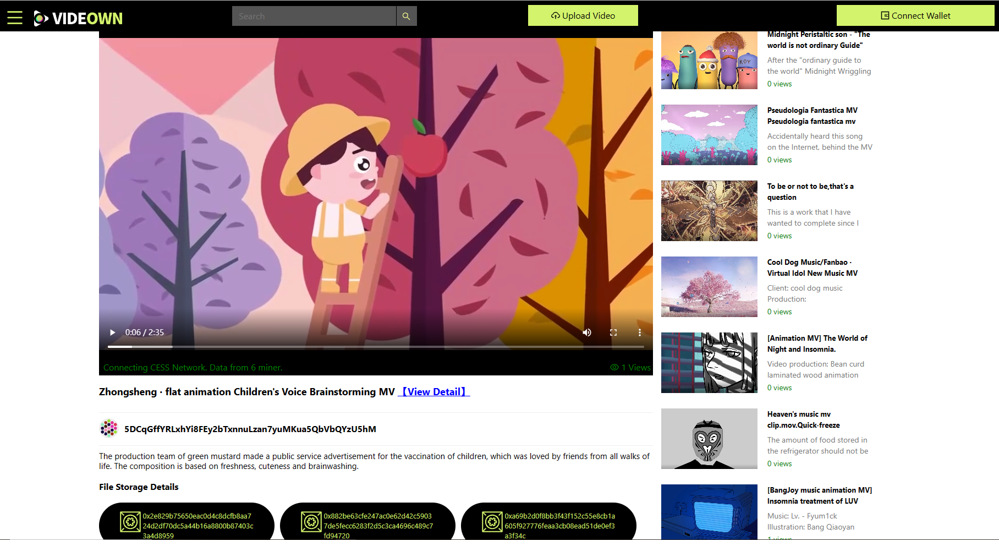

 图2 视频播放页面 

​		映入眼帘的是视频播放窗口，它的右侧是相关的视频列表，下方有视频标题、视频所有者和描述信息；页面的最下方为保存了该视频分片的矿工地址，从视频播放窗口中可以看到该视频分片分散存储在CESS链网络的六个矿工中；从播放闯关右下角可以看出该视频目前被浏览一次，点击视频标题后的View Detail链接，可以查看到该视频的详细信息，如图3所示。

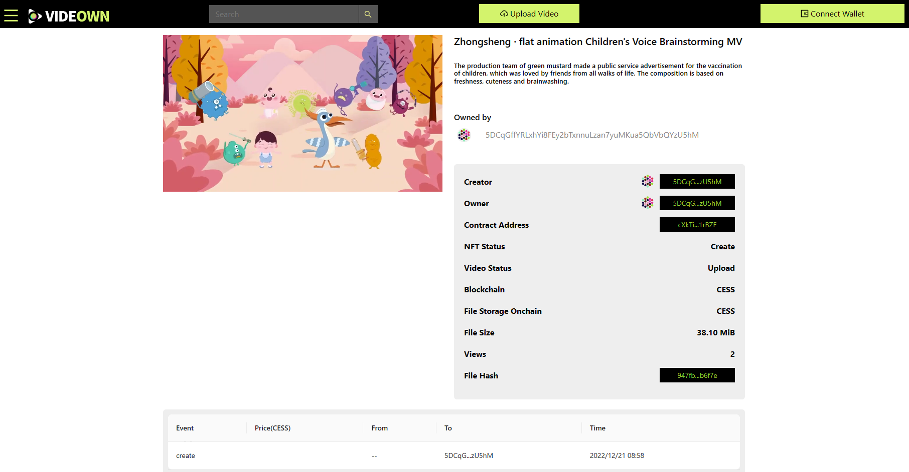

 图3 视频NFT详细信息 

​		可以看到，视频播放小窗的右侧显示了视频的详细信息，包括创作者、所有者，视频大小，存储的链信息等；最下方的File Hash展示了该视频文件的唯一数据指纹，可用于数据确权；Video Status字段显示了该视频已安全上传至存储矿工中；NFT Status显示了该视频NFT目前已处于预创建阶段（即生成了元数据但未铸造），且页面最下方的事件列表展示了视频NFT元数据的创建情况，如To字段指向了该视频的创建者。由于该视频NFT还未上架，因此没有显示购买按钮。

## 2. 系统登录

​		让我们关注videown网站的右上方，可以看到带有Connect Wallet字样的按钮，这是videown的系统登录入口。点击该按钮可导入波卡钱包账户，如图4所示；不过，在这之前您得注册了CESS链账户，并成功将其加入波卡钱包插件中，幸运的是，我们提供了一组账户地址，方便您测试使用。

 图4 导入钱包账户 

​		钱包地址如下，每个账户都有充足的余额：

| 账户                                              | 助记词                                                       |
| ------------------------------------------------- | ------------------------------------------------------------ |
| cXgG1JpVYkRF3mZa5YW2rzNdSYaWyGtNvkaPWE9FXw4Tx56Ch | rely rival fade square negative swim indoor eager gorilla bar oyster strong |
| cXie7akQvDPoWqwcaPUHx1GqugFHQKn3a9wPyRUYZQL4scmgU | hidden pudding east claw vague slam smart dose identify mango again junior |
| cXhA1Tp6ypNApG2menDRGtjixXkabugAcgCqE1EyAekAU6Aew | barely aim fringe nest flush peace settle base inhale phrase vote brand |

​		首先，您需要在浏览器中安装波卡钱包插件，可以访问[Polkadot official website](https://polkadot.js.org/extension/)下载和安装插件，如图5所示。

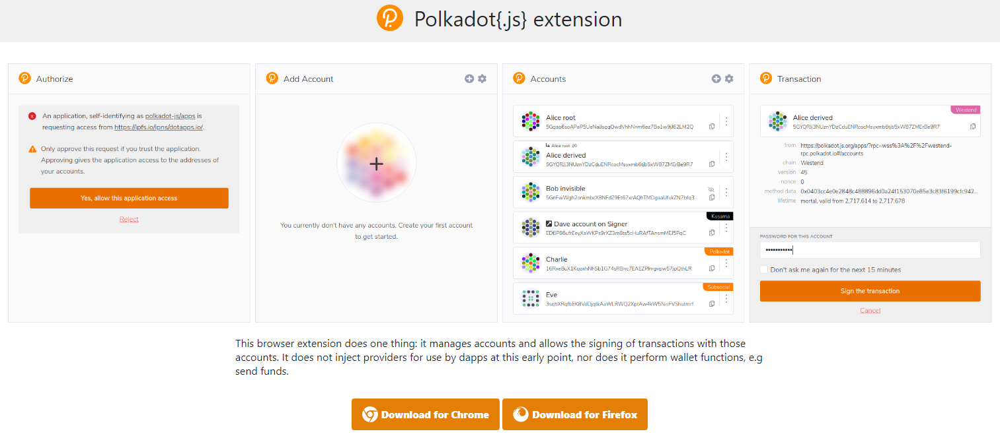

 图5 波卡钱包主页 

​		点击浏览器（这里为Chrome浏览器）右上角插件或扩展图标，打开波卡钱包，如图6高亮处所示。

 图6 浏览器插件入口 

​		点击波卡钱包右上角"+"号按钮，选择"Import account from pre-existing seed"选项来向钱包导入账户，如图7所示。

 图7 账户导入按钮 

​		按照提示要求，在“EXISTING 12 OR 24-WORD MNEMONIC SEED”输入框内输入我们给出的账户助记词，再点击下一步，如图8所示。

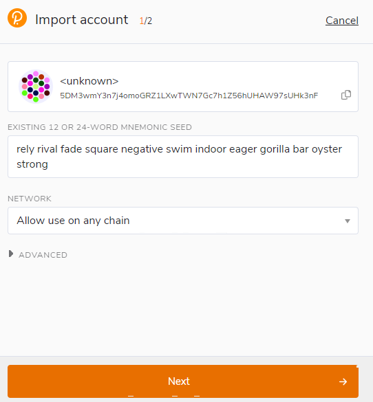

 图8 输入助记词 

​		然后输入您的账户名称，再在下方输入两次密码，点击下方橙色按钮即可完成账户导入，如图9所示。请记住您的密码，后续在交易签名中需要使用。

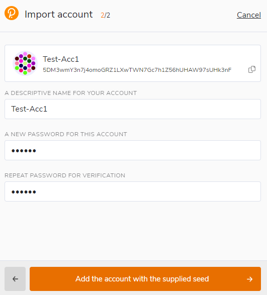

 图9 设置账户密码 

​		请按照上述步骤导入我们给出的全部账户，接下来就可以登录我们的网站了，如图10所示。

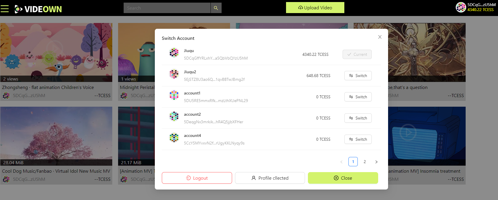

 图10 钱包登录 

​		点击账户右侧的Switch按钮可以切换账户，点击Logout可以退出登录，点击Close按钮则是关闭账户切换对话框页面，点击Profile cllected按钮进入个人主页，如图11所示。

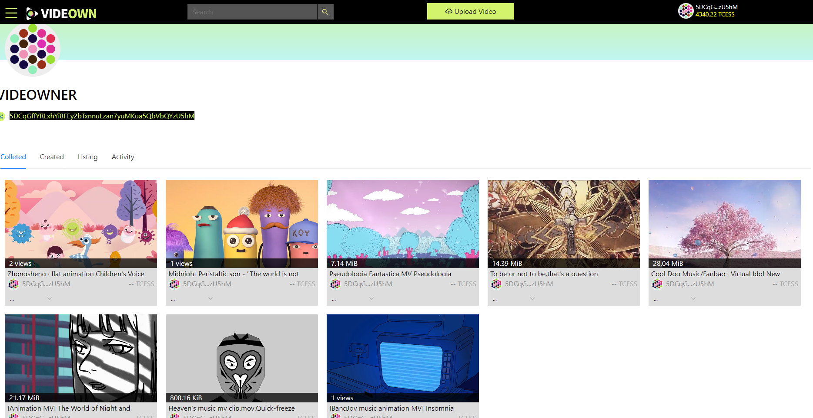

 图11 个人主页 

​		默认进入的是Colleted子页面，这里展示了该账户收集的视频信息，包括自己创建的、购买的以及别人转移（赠与）的全部视频；点击任意视频的左下角角标，可以对该视频进行管理，如图12所示。

 图12 视频NFT Colleted页面 
		

​		该视频NFT未铸造，因此只有铸造操作可选，视频NFT不同的状态可选择不同的操作，如铸造后可进行上架、转移等操作，上架后亦可下架，同时，在账户余额和存储空间充足的情况下，您还可以购买别人上架的视频NFT。

​		点击图7页面的Created按钮可以展示你所创建的视频NFT，如图13所示。可以看到，在本例中，该账户收集的视频NFT大多数是由自己创建的。

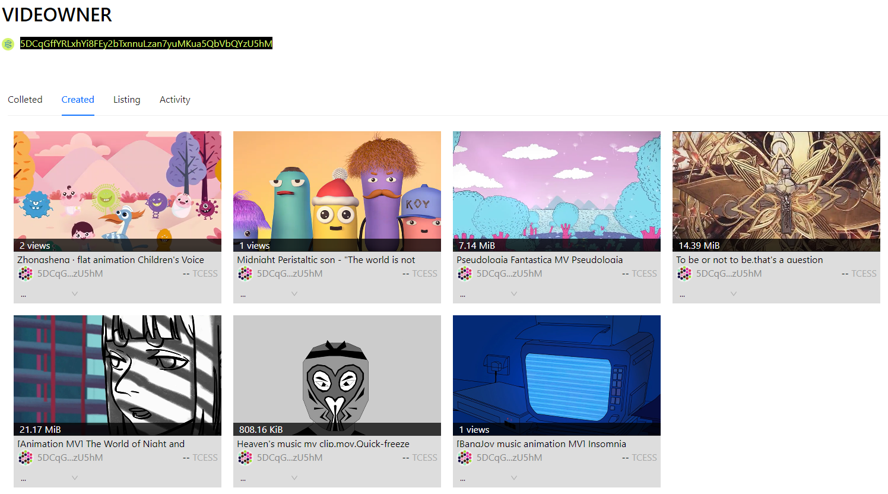

 图13 视频NFT Created页面 
		

​		点击Listing按钮可以查看你所拥有的已上架的视频NFT，如图14所示。可以看到本例账户未上架任何视频NFT。

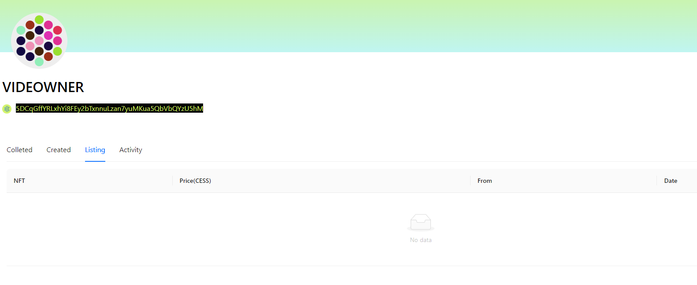

 图14 视频NFT Listing页面 

​		点击Activity按钮，可以进入该账户的事件管理界面，如图15所示。该界面会列出该账户所有的NFT变更记录，以便于用户核对资产情况。

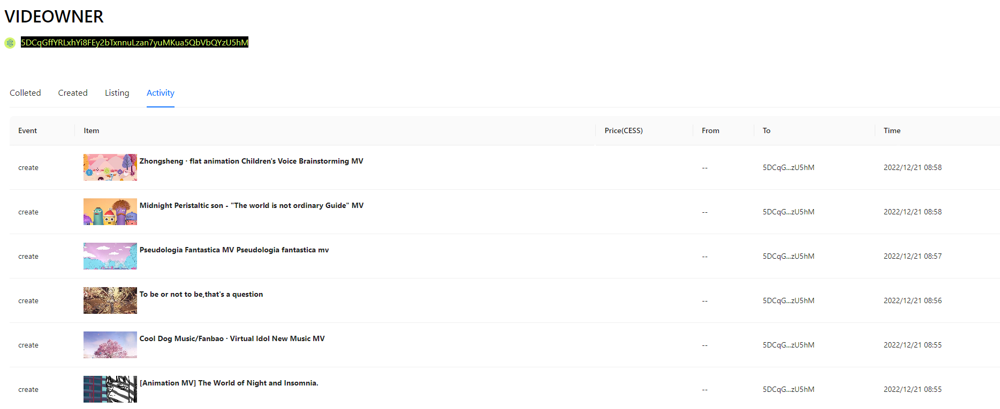

 图15 视频NFT Activity页面 

​		Activity列表中Item展示了视频NFT的标题和封面图片，左侧Event项展示状态类型，右侧From和To展示了视频NFT的流动情况，由于事件类型是create，表示创建了一个视频NFT元数据，因此From为空，而To则指向了视频NFT元数据的创建者；最后一项表示事件发生时间。

## 3. 上传视频文件

​		点击网址上方大大的Upload Video按钮，进入视频上传页面，如图16所示。在上传视频的同时，videown还将自动为视频创建NFT元数据，因此该界面也称作“创建新视频NFT”，不过上传视频文件之前，需要在CESS链上授权在videown中使用空间，以及购买足够的空间。若之前已购买并还有足够的空间时，在页面Upload Files模块右侧将显示可用空间。

 图16 视频上传页面 

​		若账户为进行空间授权，则需要先点击空间授权按钮，如图17所示。

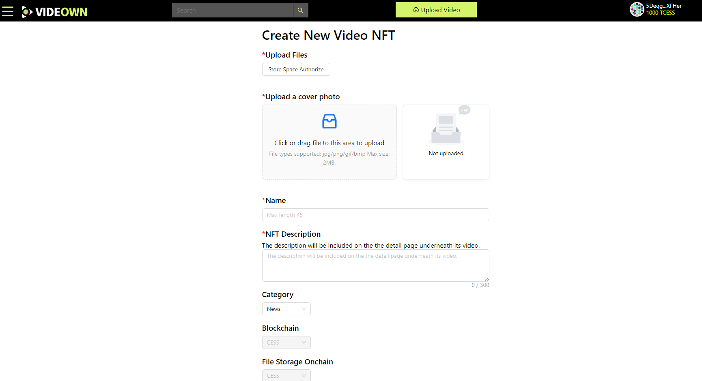

 图17 空间授权 

​		授权过程中会提示您输入账户的密码，如图18所示，该密码为您将账户导入波卡钱包时所创建的。

 图18 授权交易签名 

​		输入密码签名交易，等待几秒后，空间授权完毕，此时便可以为账户购买空间，如图19所示。

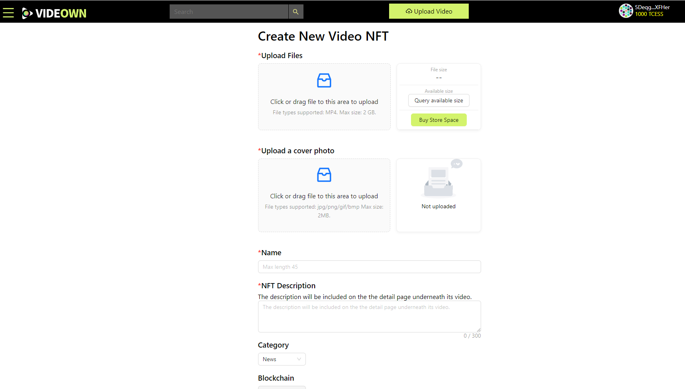

 图19 购买空间按钮 

​		点击图15 Upload Files模块右侧的Buy Store Space按钮为账户购买空间，如图20所示。

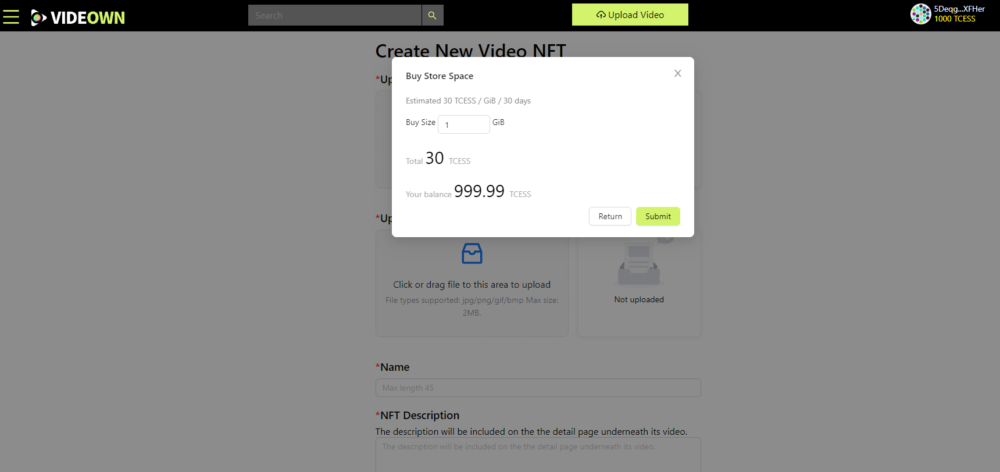

 图20 购买空间 

​		这里将提示您购买空间的价格信息，选择您所需要的空间大小，点击提交Submit按钮购买空间，也可以点击Return按钮取消购买。购买空间完成后，就可以正式开始上传视频了，输入视频文件以及对应的NFT元数据信息，如图21所示，点击最下方的create按钮即可上传视频和创建视频NFT元数据了。

 图21 上传视频 

​		之后，videown将为您跳转至视频文件上传详情页面，如图22所示。Overview模块陈列了文件上传的细节，在videown中，文件上传的整个过程都会被详细记录，您可以很轻松的完成文件溯源。Overview模块右侧上传进度显示了视频文件上传已完成，下方则展现了视频文件的哈希值（即数据指纹）；左侧的Detail模块中通过命令行的形式详细输出了文件上传过程中videown后台的处理情况；File Storage Details模块显示了存储该视频文件的矿工地址，可以看到在本例中一共有三个矿工分别存储了该视频文件所有分片；最后，在页面的最下方还提供了一个视频播放窗口，您可以在此预览该视频的内容。

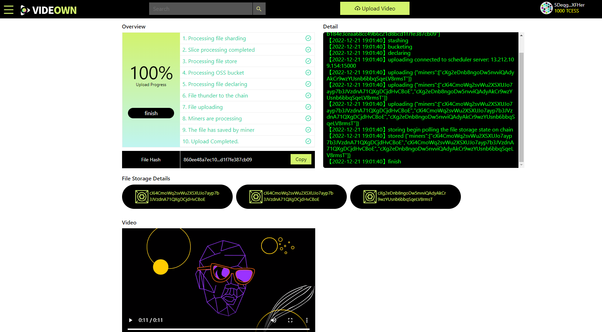

 图22 文件上传详情页面 

​		值得注意的是，Detial模块提供了交互友好的文件上传细节展示；首先，文件在分片后预存储在bucket中，bucket为CESS对象存储服务所定义的对象桶，一个账户可以创建若干个对象桶，通过桶来实现文件管理操作；之后videown后台向CESS链发布了一条文件存储声明，发送成功后便可以向调度矿工（CESS对象存储服务中用于将视频分片随机均匀的调度给存储矿工的分布式节点）发送文件分片了；调度矿工收到文件后，开始将文件分片随机分散的发送给各个矿工，如图，三次uploading过程显示了接收该文件分片的所有存储矿工；最后便是存储矿工将接收到的视频分片保存起来，最终完成视频上传流程。

## 4. 视频NFT铸造

​		当您是视频NFT文件的创建者时，您就可以铸造NFT了；进入个人主页，点击视频封面进入视频详情界面，如图23所示。

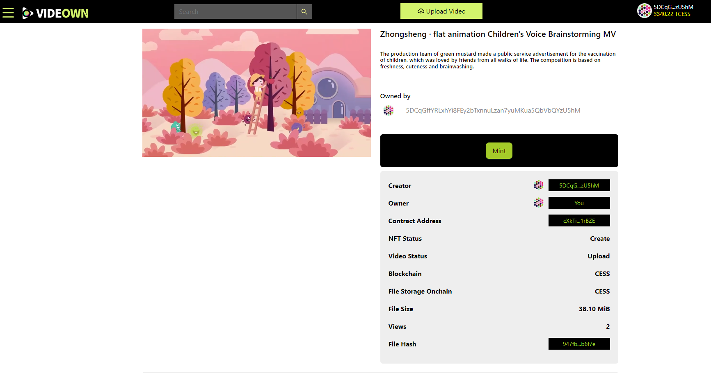

 图23 视频NFT详情页面 

​		在视频详情右下方的模块中，可以看到一个Mint按钮，点击该按钮铸造视频NFT，如图24所示。视频铸造采用Substrate Ink！合约的ERC1155标准，采用视频文件数据指纹作为NFT的Token。

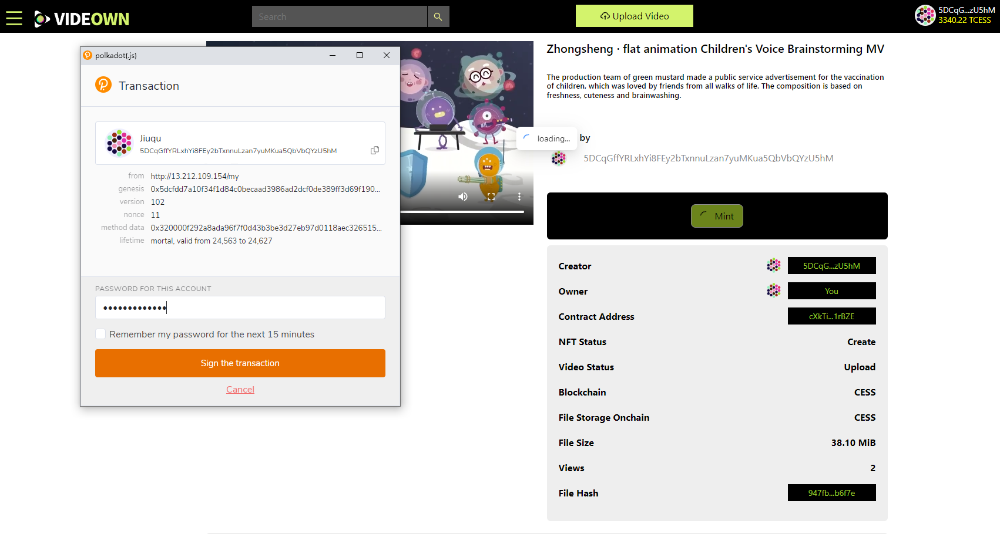

 图24 铸造视频NFT 

​		视频NFT铸造完成后会弹出窗口告诉您已经完成了铸造成功了，如图25所示。

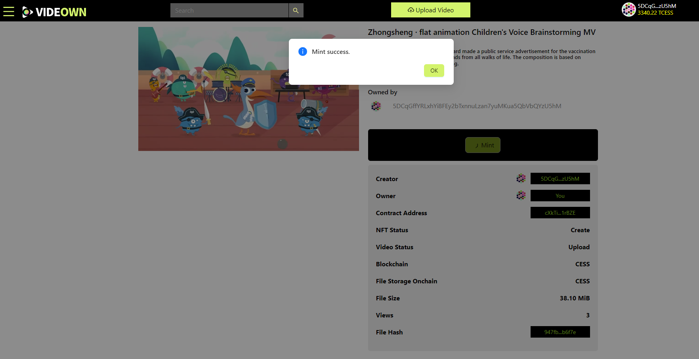

 图25 铸造成功提示 

​		之后，进入个人主页的Activity页面可查看到视频NFT铸造事件，如图26所示。该事件记录了视频NFT的铸造情况。

 图26 视频NFT铸造事件 

## 5. 视频NFT上架/下架

​		当视频NFT被铸造成功后，您可以将其上架来对外出售，同样进入个人主页中，点击已完成NFT铸造的视频的封面，进入该视频的详情界面，在之前Mint按钮同样的位置，会出现List for sale按钮，如图27所示。

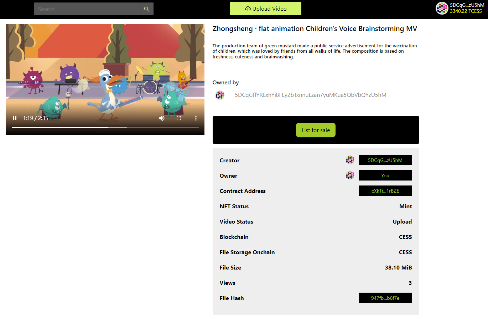

 图27 视频NFT详情 

​		点击List for sale按钮，进入视频NFT上架页面，向CESS链发送NFT上架交易请求，如图28所示。该案例为上架一个价格为125TESS的视频NFT

 图28 视频NFT上架页面 

​		上架成功后，同样会有提示，如图29所示。

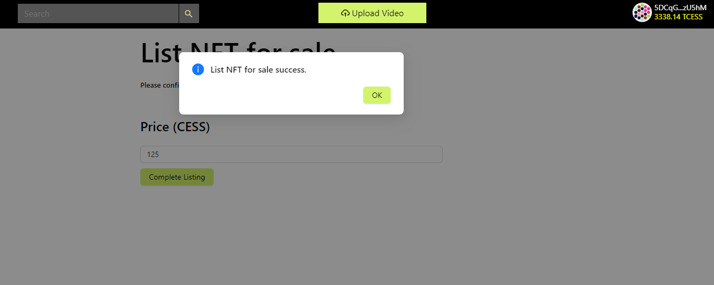

 图29 上架成功提示 

​		进入视频NFT详情页面，可以查看到价格信息以及上架的交易事件，如图30所示。

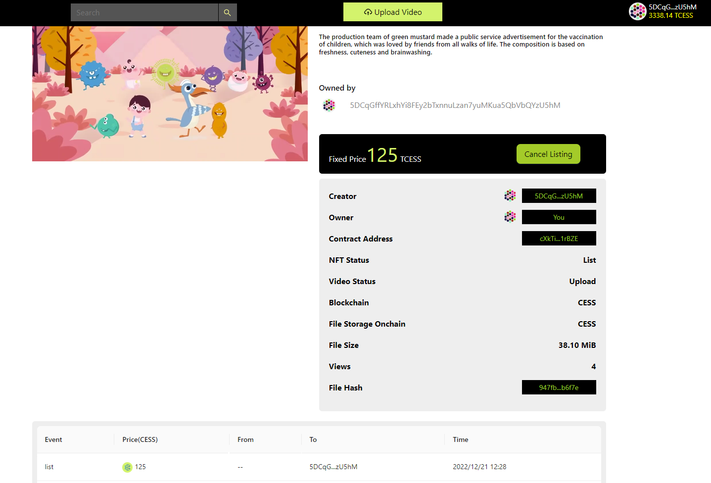

 图30 视频NFT详情 

​		与上架类似，点击该界面的Cancel Listing按钮，将以上架的视频NFT下架，如图31所示，该视频NFT已下架，此时下架按钮又变成了上架按钮。

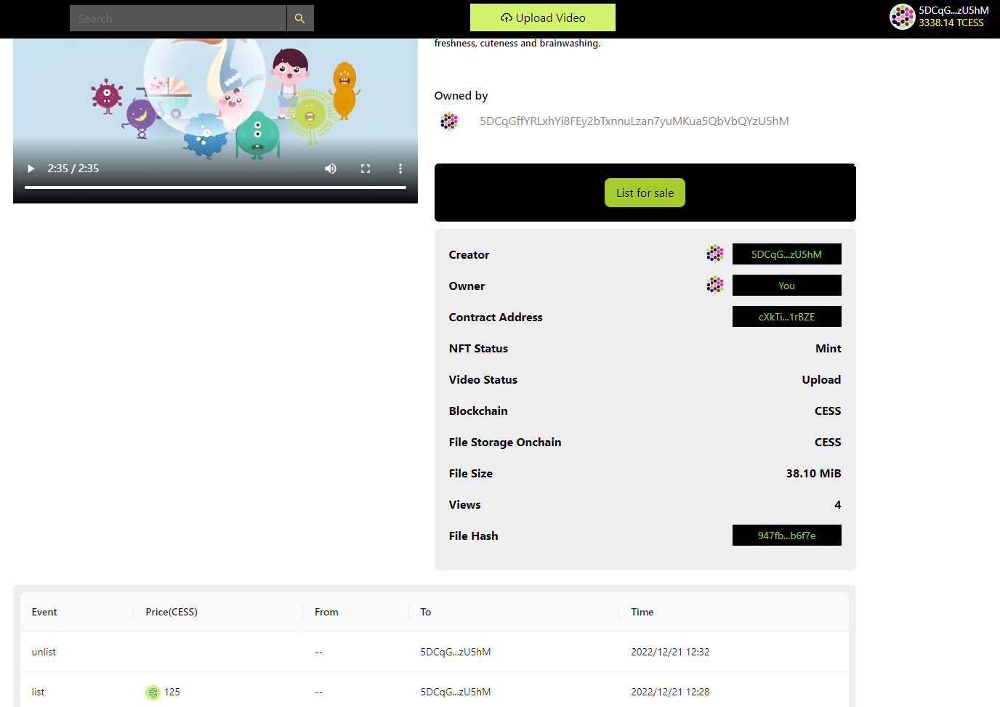

 图31 视频NFT详情 

## 6. 视频NFT购买

​		您可以浏览videown视频列表，购买已上架的视频NFT；先上架一个视频，再通过另一个账户购进入该视频的播放页面，如图32所示。

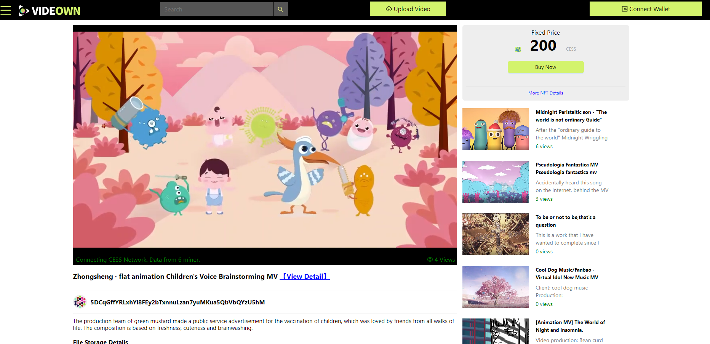

 图32 视频播放页面 

​		可以看到，在视频播放窗口的左上角多了一个价格标签以及购买按钮，点击购买按钮进入视频NFT购买界面，如图33所示。

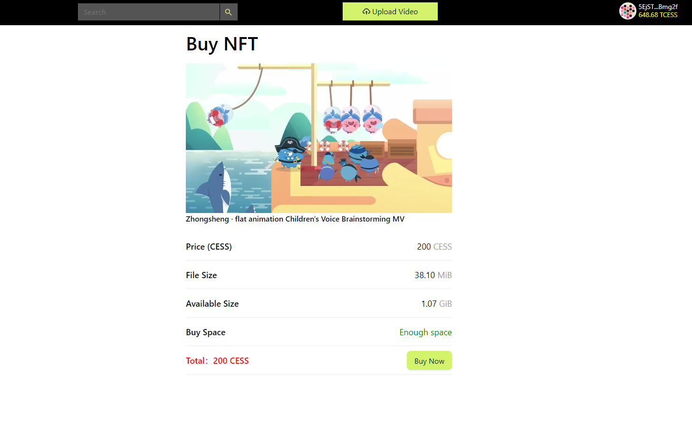

 图33 视频NFT购买页面 

​		点击该界面的购买按钮完成视频NFT的购买，交易成功后，视频NFT将转入您账户下，并且NFT Status会变成铸造状态（购买后自动下架），这样做是合理的，当您需要出售该视频NFT时，重新上架即可，防止您的视频NFT并非您所愿的情况下被别人买走。同样，购买成功后会弹出对应的提示，此处不再赘述。进入您该视频的详情界面，您同样可观察到购买事件已出现在该视频NFT的事件列表中，如图34所示。

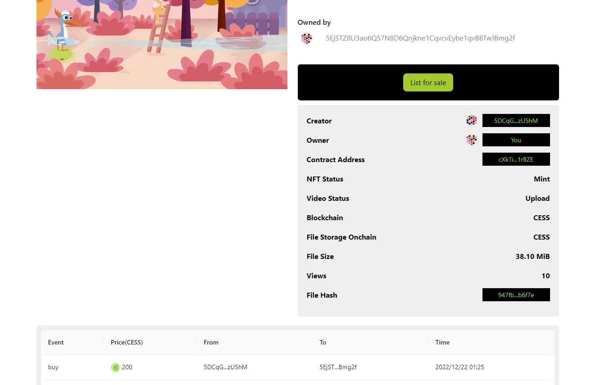

 图34 视频NFT详情 

​		当您的账户空间余额或账户余额不足时，将在视频NFT购买界面显示警告信息，待您的账户满足要求时才可进行购买，如图35展示了空间不足的情况。

 图35 空间不足提示 

## 7. 视频NFT转移

​		当您希望将自己的NFT赠与给别人时，可以进入个人主页Collected界面，点击对应视频左下角角标按钮，您会发现在弹出的操作列表中出现了一个transfer按钮，如图36所示。点击该按钮进入视频NFT转移界面。需要注意的是，只有当视频NFT已铸造且未上架时可以进行转移，因为上架的视频NFT随时可能被别人买走导致转移操作的失败。

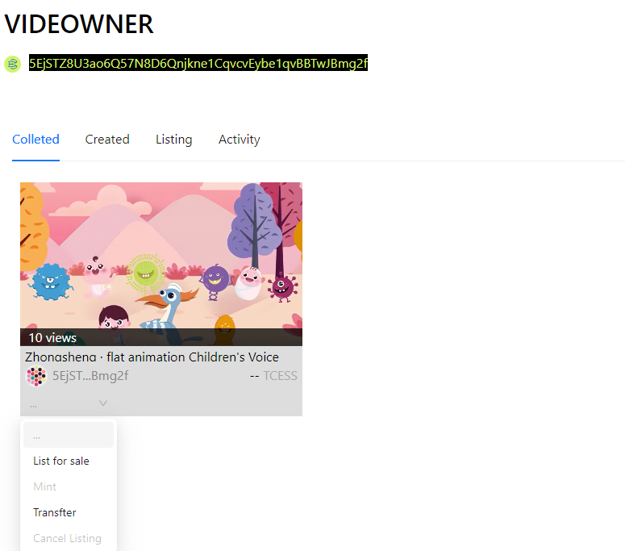

 图36 视频NFT转移入口 

​		进入视频NFT转移界面后，在地址栏中输入接收方的地址，点击Transfer按钮将该视频NFT转移至对方名下，如图37所示。若对方账户没有足够的空间存放，就会导致交易失败。

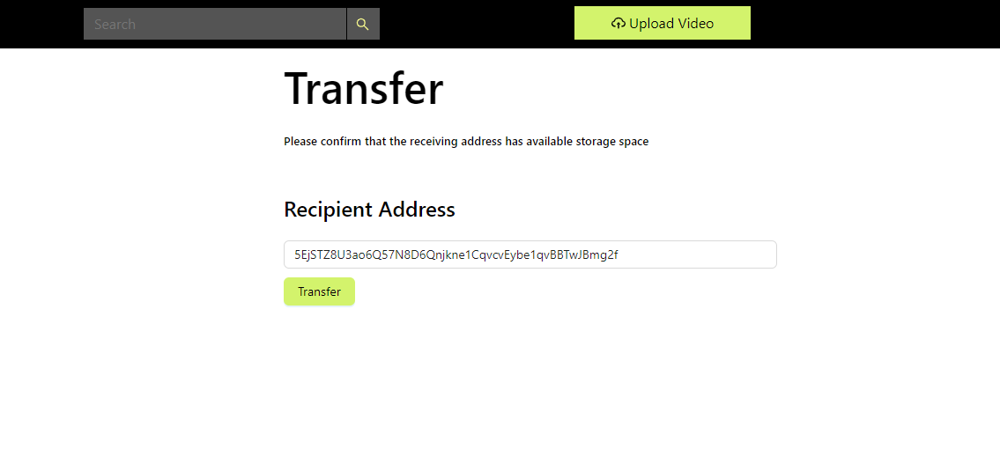

 图37 视频NFT转移页面 

​		转移成功后，同样会有提示。之后，进入您个人主页的Activity页面，可以看到该视频NFT的转移事件，如图38所示。

 图28 视频NFT转移事件 

## 8.其他

​		到这里，videown的主要功能已基本讲解完毕，剩下一些细枝末节将在随后补充。

​		在videown网站最上方有个醒目的搜索框，在上面输入您想要搜索的关键字，点击放大镜图标后会筛选出您向看到的视频内容，如图39所示。

 图39 检索视频 

​		在您登录钱包账户后，点击videown右上方的账户图标，在弹出的对话框的左下方有一个退出登录的按钮，如图40所示。点击该按钮将使videown与您的钱包解绑，回到未导入账户之前的状态。

 图40 退出登录 

​		点击videown左上方的VIDEOWN图标，会回到主页，这与大多数网站相同。点击VIDEOWN图标左侧的三条横线的图标，可以看到扩展内容，如图41所示。

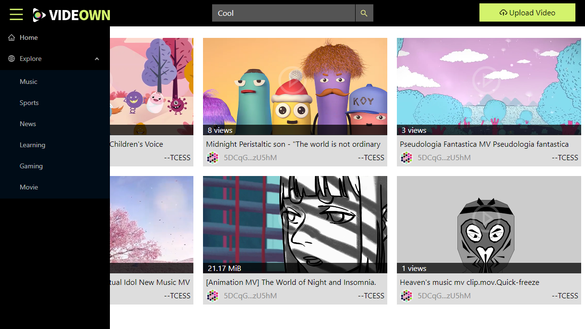

 图41 探索与未来 

​		Explore字段下方的内容为videown将来要扩展的模块，目前我们实现了视频NFT的一系列功能，这也是videown的初衷；将来我们会一一实现诸如音乐、运动、新闻等多种扩展模块，将videown打造成优秀的去中心化综合视频NFT平台，所以，尽情期待吧！